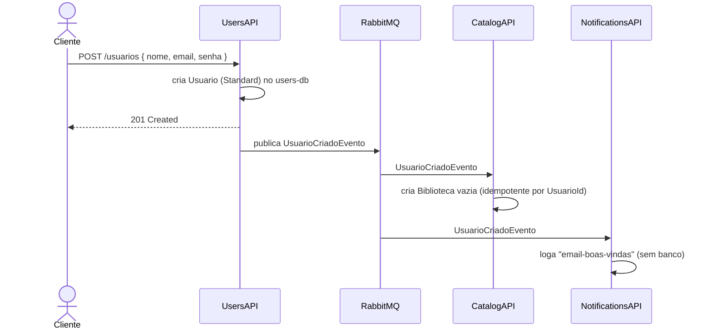
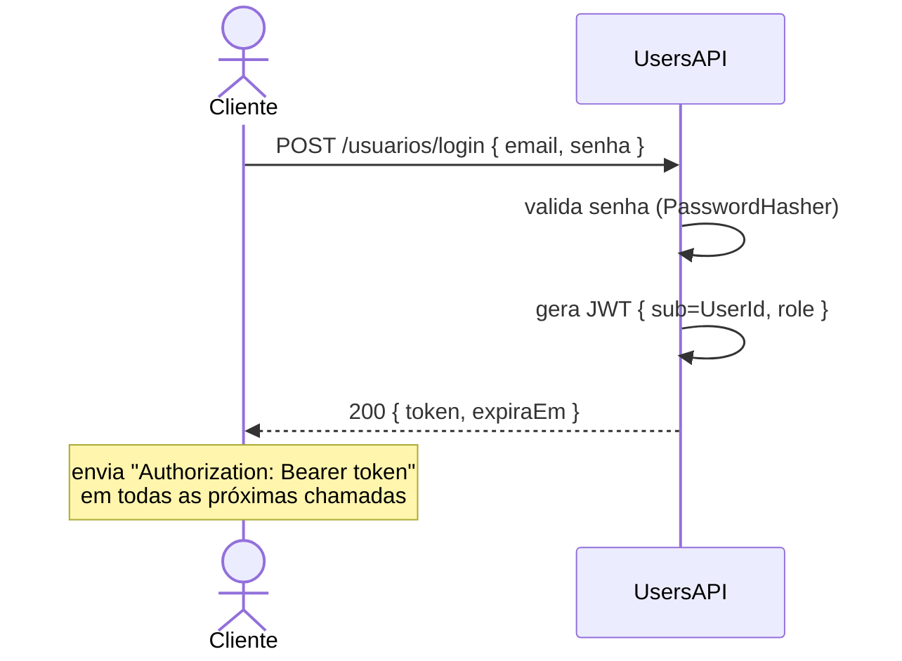
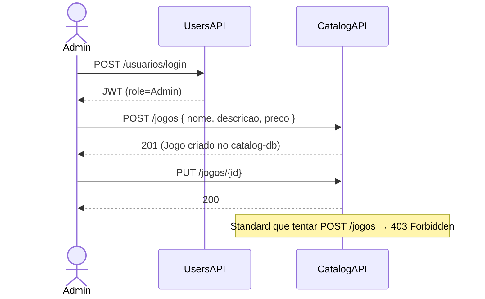
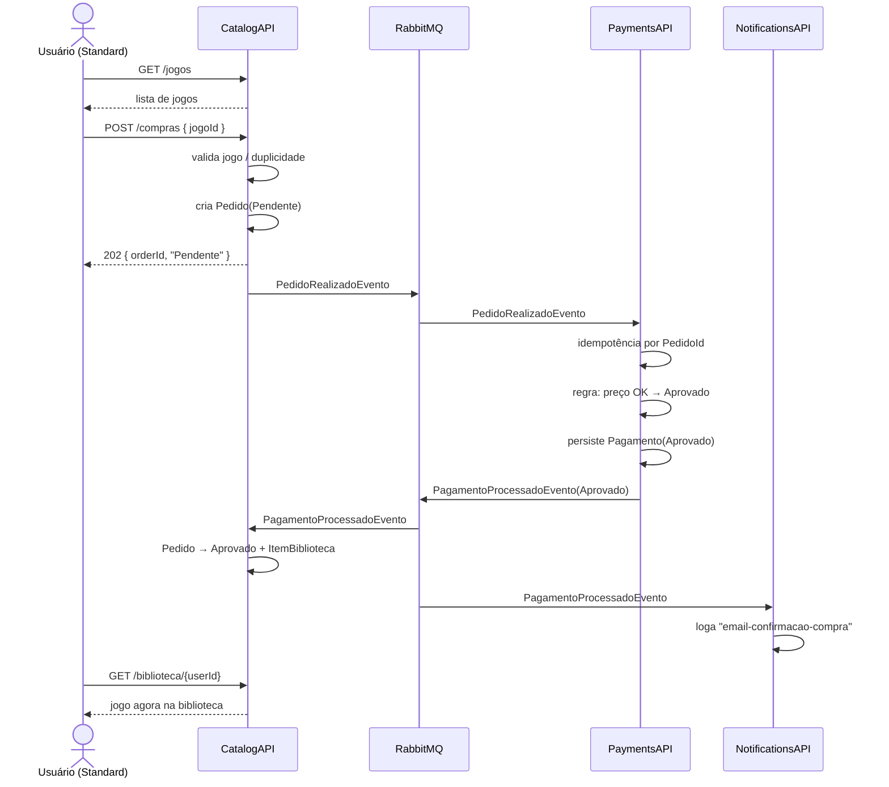
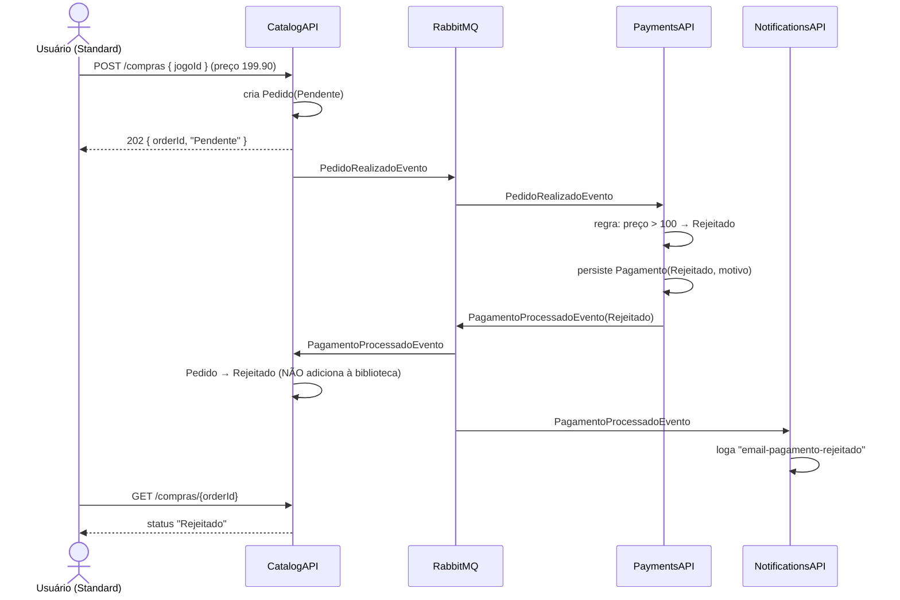
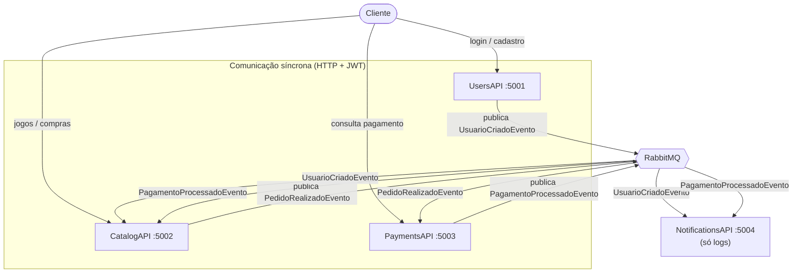

# FCGames — Referência de API, Contratos e Dados

> Documentação técnica detalhada dos 4 microsserviços.
> Para visão arquitetural geral, ver o [CLAUDE.md](../../CLAUDE.md) na raiz do monorepo.

**Índice**
- [Convenções gerais](#convenções-gerais)
- [Jornadas do Usuário (fluxos completos)](#jornadas-do-usuário-fluxos-completos)
- [1. UsersAPI](#1-usersapi-5001)
- [2. CatalogAPI](#2-catalogapi-5002)
- [3. PaymentsAPI](#3-paymentsapi-5003)
- [4. NotificationsAPI](#4-notificationsapi-5004)
- [5. Contratos de Eventos](#5-contratos-de-eventos)
- [6. Mapa de Dados por Serviço](#6-mapa-de-dados-por-serviço)

---

## Convenções gerais

### Autenticação
- JWT Bearer emitido **exclusivamente** pelo UsersAPI.
- Demais serviços apenas **validam** o token (`ValidateAudience = false`).
- Header: `Authorization: Bearer <token>`
- Claims relevantes: `sub` (UserId), `role` (Standard | Admin).

### CorrelationId
- Todo request aceita o header `x-correlation-ID`.
- Se ausente, o serviço gera um GUID e devolve no response.
- O mesmo valor é propagado para os eventos publicados e para todos os logs.

### Formato de erro (ErrorHandlingMiddleware)
```json
{
  "statusCode": 400,
  "message": "Mensagem amigável do erro"
}
```
Para erros de validação (FluentValidation):
```json
{
  "statusCode": 400,
  "errors": [
    { "field": "Email", "message": "Email é obrigatório" }
  ]
}
```

### Status HTTP usados
| Código | Quando |
|--------|--------|
| 200 | Consulta/atualização bem-sucedida |
| 201 | Recurso criado (cadastro) |
| 202 | Aceito para processamento assíncrono (POST /compras) |
| 400 | Validação ou regra de negócio |
| 401 | Sem token / token inválido |
| 403 | Token válido mas sem permissão (role) |
| 404 | Recurso não encontrado |
| 409 | Conflito (ex: jogo já possuído) |

---

## Jornadas do Usuário (fluxos completos)

Esta seção explica **o que cada perfil pode fazer** e **como os serviços se comunicam**
em cada jornada. É a leitura recomendada para quem está entendendo o projeto pela
primeira vez ou roteirizando o vídeo de demonstração.

### Perfis de acesso (roles)

| Ação | Anônimo | Standard | Admin |
|------|:-------:|:--------:|:-----:|
| Cadastrar-se (`POST /usuarios`) | ✅ | ✅ | ✅ |
| Fazer login (`POST /usuarios/login`) | ✅ | ✅ | ✅ |
| Listar/editar usuários | ❌ | ❌ | ✅ |
| Ver catálogo de jogos (`GET /jogos`) | ❌ | ✅ | ✅ |
| Cadastrar/editar/excluir jogos | ❌ | ❌ | ✅ |
| Comprar jogo (`POST /compras`) | ❌ | ✅ | ✅ |
| Ver a própria biblioteca | ❌ | ✅ | ✅ |
| Consultar status de pagamento | ❌ | ✅ | ✅ |

> O perfil vem do claim `role` dentro do JWT. O token é emitido no login pelo UsersAPI.
> Endpoints `[Authorize]` exigem qualquer token válido; `[Authorize Admin]` exigem `role=Admin`.

---

### Jornada 0 — Onde nasce o primeiro Admin

O sistema precisa de pelo menos um Admin para cadastrar jogos. Como o `POST /usuarios`
cria sempre um usuário **Standard**, o primeiro Admin vem de um **seed** no banco do
UsersAPI (criado na migration/startup). A partir dele, um Admin pode promover outros
via `PUT /usuarios/{id}`.

```
Seed inicial (users-db) → admin@fcgames.com / senha definida em env var
```

---

### Jornada 1 — Cadastro de um novo usuário

**Quem:** qualquer pessoa (anônimo). **Resultado:** conta criada + biblioteca pronta + e-mail de boas-vindas (log).



**Por que assíncrono?** O cadastro responde `201` imediatamente. A criação da biblioteca
e a notificação acontecem em background — se o CatalogAPI estiver fora do ar, a mensagem
fica na fila e é processada quando ele voltar. O cadastro **não falha** por causa disso.

---

### Jornada 2 — Login (obter o token)

**Quem:** usuário já cadastrado. **Resultado:** JWT para usar nos demais serviços.



> Nenhum outro serviço tem login. Catalog e Payments apenas **validam** este token.

---

### Jornada 3 — Admin monta o catálogo

**Quem:** Admin. **Resultado:** jogos disponíveis para compra. **Comunicação:** síncrona (só CatalogAPI, sem eventos).



---

### Jornada 4 — Usuário comum compra um jogo (fluxo APROVADO)

**Quem:** Standard. **Resultado:** jogo na biblioteca + e-mail de confirmação.
Esta é a jornada que **conecta os 4 serviços**.



**Consultas finais que o usuário pode fazer:**
- `GET /compras/{orderId}` (CatalogAPI) → status `Aprovado`
- `GET /pagamentos/{orderId}` (PaymentsAPI) → `{ status: "Aprovado" }`

---

### Jornada 5 — Compra REJEITADA

**Quem:** Standard. **Gatilho:** preço > 100 (regra determinística para a demo).
Mesmo caminho da Jornada 4 até o PaymentsAPI, onde a regra muda o desfecho.



---

### Resumo visual — quem fala com quem



| Tipo | Quem | Característica |
|------|------|---------------|
| **Síncrono (HTTP)** | Cliente → cada API | Precisa de JWT, exceto cadastro/login/health |
| **Assíncrono (eventos)** | APIs ↔ RabbitMQ | Desacoplado, resiliente, idempotente |

> **Regra de ouro:** toda comunicação **entre serviços** é assíncrona via eventos.
> Comunicação **cliente → serviço** é síncrona via HTTP. Nenhum serviço chama outro
> serviço diretamente por HTTP.

---

## 1. UsersAPI (:5001)

**Tipo:** API completa. Único emissor de JWT.
**Publica:** `UsuarioCriadoEvento` · **Consome:** nada · **Banco:** users-db

### Endpoints

#### `POST /usuarios` — [AllowAnonymous]
Cadastro público de usuário.

**Request**
```json
{
  "nome": "Maria Silva",
  "email": "maria@email.com",
  "senha": "Senha@123"
}
```
**Response `201 Created`**
```json
{
  "id": "9b2e...-guid",
  "nome": "Maria Silva",
  "email": "maria@email.com",
  "tipoAcesso": "Standard"
}
```
**Efeito colateral:** publica `UsuarioCriadoEvento` após o commit.

---

#### `POST /usuarios/login` — [AllowAnonymous]
Autentica e retorna JWT.

**Request**
```json
{ "email": "maria@email.com", "senha": "Senha@123" }
```
**Response `200 OK`**
```json
{
  "token": "eyJhbGci...",
  "expiraEm": "2026-06-20T12:00:00Z"
}
```
**Erro `400`** — credenciais inválidas (LoginException).

---

#### `GET /usuarios` — [Authorize Admin]
Lista todos os usuários.
**Response `200 OK`** — array de `{ id, nome, email, tipoAcesso }`.

---

#### `GET /usuarios/{id}` — [Authorize Admin]
Detalhe de um usuário. `404` se não existir.

---

#### `PUT /usuarios/{id}` — [Authorize Admin]
Atualiza nome/email/tipoAcesso.

**Request**
```json
{ "nome": "Maria S. Souza", "tipoAcesso": "Admin" }
```
**Response `200 OK`** — usuário atualizado.

---

#### `GET /health` — sem auth
**Response `200 OK`** — `{ "status": "Healthy" }`

---

## 2. CatalogAPI (:5002)

**Tipo:** API + Worker.
**Publica:** `PedidoRealizadoEvento` · **Consome:** `UsuarioCriadoEvento`, `PagamentoProcessadoEvento` · **Banco:** catalog-db

### Endpoints

#### `GET /jogos` — [Authorize]
Lista o catálogo de jogos.
**Response `200 OK`**
```json
[
  { "id": "guid", "nome": "Elden Ring", "descricao": "RPG de ação", "preco": 199.90 }
]
```

---

#### `POST /jogos` — [Authorize Admin]
Cadastra novo jogo.
**Request**
```json
{ "nome": "Hades", "descricao": "Roguelike", "preco": 49.90 }
```
**Response `201 Created`** — jogo criado com `id`.

---

#### `PUT /jogos/{id}` — [Authorize Admin]
Atualiza um jogo. `404` se não existir.

---

#### `DELETE /jogos/{id}` — [Authorize Admin]
Remove um jogo. `404` se não existir.

---

#### `POST /compras` — [Authorize]
Inicia a compra de um jogo. Fluxo assíncrono.

**Request**
```json
{ "jogoId": "guid-do-jogo" }
```
> UserId é extraído do JWT, **não** vem no body.

**Comportamento**
1. Valida que o jogo existe → senão `404`.
2. Valida que o usuário ainda não possui o jogo → senão `409`.
3. Cria `Pedido` com status `Pending`.
4. Publica `OrderPlacedEvent`.
5. Retorna `202 Accepted`.

**Response `202 Accepted`**
```json
{ "orderId": "guid-do-pedido", "status": "Pendente" }
```

---

#### `GET /compras/{orderId}` — [Authorize]
Consulta status do pedido.
**Response `200 OK`**
```json
{ "orderId": "guid", "jogoId": "guid", "preco": 49.90, "status": "Aprovado" }
```
> Status: `Pendente | Aprovado | Rejeitado`

---

#### `GET /biblioteca/{usuarioId}` — [Authorize]
Lista os jogos que o usuário possui.
**Response `200 OK`**
```json
{
  "usuarioId": "guid",
  "jogos": [
    { "jogoId": "guid", "nome": "Hades", "preco": 49.90, "dataAdicao": "2026-06-20T10:00:00Z" }
  ]
}
```

---

#### `GET /health` — sem auth

### Consumers (Worker)

| Evento consumido | Ação | Idempotência |
|------------------|------|--------------|
| `UsuarioCriadoEvento` | Cria `Biblioteca` vazia para o UsuarioId | por `UsuarioId` (unique) |
| `PagamentoProcessadoEvento` | Aprovado → Pedido `Aprovado` + `ItemBiblioteca`; Rejeitado → Pedido `Rejeitado` | por `PedidoId` |

---

## 3. PaymentsAPI (:5003)

**Tipo:** Worker + API mínima (só consulta).
**Publica:** `PagamentoProcessadoEvento` · **Consome:** `PedidoRealizadoEvento` · **Banco:** payments-db

### Endpoints

#### `GET /pagamentos/{orderId}` — [Authorize]
Consulta o status de um pagamento.
**Response `200 OK`**
```json
{
  "orderId": "guid",
  "valor": 49.90,
  "status": "Aprovado",
  "motivo": null,
  "processadoEm": "2026-06-20T10:00:05Z"
}
```
`404` se não houver pagamento para o OrderId.

---

#### `GET /health` — sem auth

### Consumer (Worker — núcleo do serviço)

| Evento consumido | Ação | Idempotência |
|------------------|------|--------------|
| `PedidoRealizadoEvento` | Aplica regra determinística, persiste `Pagamento`, publica `PagamentoProcessadoEvento` | por `PedidoId` (unique) |

**Regra de aprovação determinística** (documentada para a demo):
```
Preço <= 0   → Rejeitado   (Motivo: "Valor inválido")
Preço > 100  → Rejeitado   (Motivo: "Limite de crédito excedido")
Demais       → Aprovado
```
> A regra `> 100 → Rejected` é intencional: permite demonstrar o fluxo Rejected no vídeo sem precisar de dados inválidos.

**Retry:** 3x com backoff exponencial (configurado no MassTransit).

---

## 4. NotificationsAPI (:5004)

**Tipo:** Worker puro. Stateless, **sem banco**.
**Publica:** nada · **Consome:** `UsuarioCriadoEvento`, `PagamentoProcessadoEvento`

### Endpoints

#### `GET /health` — sem auth
Único endpoint HTTP. Necessário para o liveness/readiness probe do k8s.

### Consumers (Worker — único propósito)

| Evento consumido | Log gerado |
|------------------|-----------|
| `UsuarioCriadoEvento` | `{ "tipo": "email-boas-vindas", "destinatario": email, "nome": nome, "correlationId": ... }` |
| `PagamentoProcessadoEvento` (Aprovado) | `{ "tipo": "email-confirmacao-compra", "jogo": nomeJogo, "valor": preco, "correlationId": ... }` |
| `PagamentoProcessadoEvento` (Rejeitado) | `{ "tipo": "email-pagamento-rejeitado", "motivo": motivo, "correlationId": ... }` |

> A "prova" da notificação é o log JSON estruturado, visível via `docker logs` / `kubectl logs`.

---

## 5. Contratos de Eventos

**Pacote:** `FCGames.IntegrationEvents` · **Namespace:** `FCGames.IntegrationEvents`
**Repo:** [fcg-integration-events](https://github.com/FIAP-POS-TECH-TEAM-10/fcg-integration-events)

> MassTransit roteia por namespace + nome do tipo. O namespace é parte do contrato.

### UsuarioCriadoEvento
Publicado por **UsersAPI** → Consumido por **CatalogAPI**, **NotificationsAPI**

| Campo | Tipo | Descrição |
|-------|------|-----------|
| `UsuarioId` | `Guid` | Id do usuário criado |
| `Nome` | `string` | Nome do usuário |
| `Email` | `string` | Email (destinatário da notificação) |
| `CriadoEmUtc` | `DateTime` | Timestamp do cadastro (UTC) |
| `CorrelationId` | `Guid` | Rastreamento ponta a ponta |

### PedidoRealizadoEvento
Publicado por **CatalogAPI** → Consumido por **PaymentsAPI**

| Campo | Tipo | Descrição |
|-------|------|-----------|
| `PedidoId` | `Guid` | Id do pedido (chave de idempotência) |
| `UsuarioId` | `Guid` | Comprador |
| `JogoId` | `Guid` | Jogo comprado |
| `NomeJogo` | `string` | Nome do jogo (denormalizado p/ notificação) |
| `Preco` | `decimal` | Preço no momento da compra |
| `RealizadoEmUtc` | `DateTime` | Timestamp do pedido (UTC) |
| `CorrelationId` | `Guid` | Rastreamento |

### PagamentoProcessadoEvento
Publicado por **PaymentsAPI** → Consumido por **CatalogAPI**, **NotificationsAPI**

| Campo | Tipo | Descrição |
|-------|------|-----------|
| `PedidoId` | `Guid` | Id do pedido (idempotência) |
| `UsuarioId` | `Guid` | Comprador |
| `JogoId` | `Guid` | Jogo |
| `NomeJogo` | `string` | Nome do jogo |
| `Preco` | `decimal` | Valor processado |
| `Status` | `string` | `"Aprovado"` \| `"Rejeitado"` |
| `Motivo` | `string?` | Motivo da rejeição (null se Aprovado) |
| `ProcessadoEmUtc` | `DateTime` | Timestamp do processamento (UTC) |
| `CorrelationId` | `Guid` | Rastreamento |

### Filas (MassTransit — convenção `{serviço}-{evento}`)
| Fila | Serviço | Evento |
|------|---------|--------|
| `catalog-usuario-criado` | CatalogAPI | UsuarioCriadoEvento |
| `catalog-pagamento-processado` | CatalogAPI | PagamentoProcessadoEvento |
| `payments-pedido-realizado` | PaymentsAPI | PedidoRealizadoEvento |
| `notifications-usuario-criado` | NotificationsAPI | UsuarioCriadoEvento |
| `notifications-pagamento-processado` | NotificationsAPI | PagamentoProcessadoEvento |

---

## 6. Mapa de Dados por Serviço

### users-db (UsersAPI)
```
Usuarios
├── Id           GUID    PK
├── Nome         string
├── Email        string  UNIQUE
├── SenhaHash    string
├── TipoAcesso   int     (0=Standard, 1=Admin)
└── CriadoEm     datetime
```

### catalog-db (CatalogAPI)
```
Jogos
├── Id           GUID    PK
├── Nome         string
├── Descricao    string
├── Preco        decimal
└── DataCadastro datetime

Bibliotecas
├── Id           GUID    PK
├── UsuarioId    GUID    UNIQUE   (1 biblioteca por usuário)
└── CriadaEm     datetime

ItensBiblioteca
├── Id            GUID    PK
├── BibliotecaId  GUID    FK → Bibliotecas.Id
├── JogoId        GUID    FK → Jogos.Id
├── DataAdicao    datetime
└── UNIQUE(BibliotecaId, JogoId)            (impede jogo duplicado)

Pedidos
├── Id           GUID    PK
├── UsuarioId    GUID
├── JogoId       GUID    FK → Jogos.Id
├── Preco        decimal
├── Status       int     (0=Pending, 1=Approved, 2=Rejected)
└── CriadoEm     datetime
```

### payments-db (PaymentsAPI)
```
Pagamentos
├── Id            GUID    PK
├── OrderId       GUID    UNIQUE   (chave de idempotência)
├── UsuarioId     GUID
├── JogoId        GUID
├── Valor         decimal
├── Status        int     (0=Pending, 1=Approved, 2=Rejected)
├── Motivo        string? (null se Approved)
└── ProcessadoEm  datetime
```

### notifications (NotificationsAPI)
```
SEM BANCO DE DADOS — stateless.
Estado vive apenas nos logs JSON estruturados.
```

### Relação entre os dados (chaves de correlação)
```
UserId   → atravessa Users, Catalog (Biblioteca/Pedido) e Payments
GameId   → Jogos (Catalog) referenciado em Pedidos, Pagamentos, ItensBiblioteca
OrderId  → Pedido (Catalog) ↔ Pagamento (Payments)   [1:1 via eventos]
```
> Não há FK entre bancos — cada serviço é dono do seu banco.
> A consistência é **eventual**, garantida pela troca de eventos.
