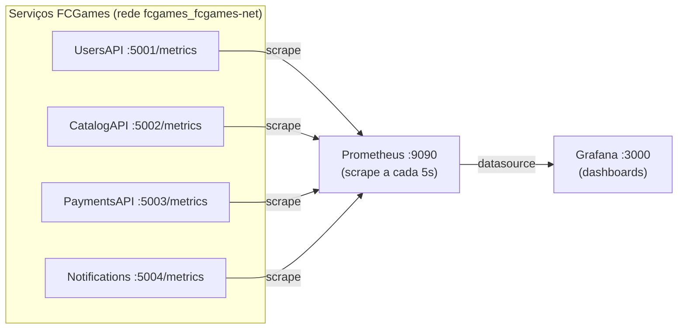

# Observabilidade — Prometheus + Grafana

Stack de **métricas open-source** do FCGames. Os microsserviços expõem métricas no
formato Prometheus e um dashboard no Grafana mostra, em tempo real, **latência de
requisições, contagem de requisições (total e por status code HTTP) e taxa de erros**.

> 🔧 Como subir a stack de aplicação: [`../README.md`](../README.md)
> 📐 Visão geral do monorepo: [`../../README.md`](../../README.md)

---

## 1. O que foi implementado

Duas partes:

1. **Instrumentação dos serviços** — cada API HTTP passou a expor um endpoint
   `/metrics` usando o pacote [`prometheus-net.AspNetCore`](https://github.com/prometheus-net/prometheus-net).
2. **Stack de coleta e visualização** — um novo diretório irmão
   [`fcg-observabilidade-service/`](../../fcg-observabilidade-service/) com Prometheus
   (coleta) + Grafana (dashboards), provisionados automaticamente.

| Serviço | Container | Porta | `/metrics` |
|---|---|---|---|
| UsersAPI | `fcg-users-api` | 5001 | ✅ |
| CatalogAPI | `fcg-catalog-api` | 5002 | ✅ |
| PaymentsAPI | `fcg-payments-api` | 5003 | ✅ |
| Notifications | `fcg-notifications-worker` | 5004 | ✅ (só runtime + `/health`) |

> Os workers de fundo (`catalog-worker`, `payments-worker`) não expõem HTTP e ficam
> fora do escopo — não têm servidor para publicar `/metrics`.

---

## 2. Como funciona a instrumentação

Em cada `Program.cs` das APIs, duas linhas ligam as métricas HTTP (padrão validado
primeiro no `fcg-users-service`):

```csharp
using Prometheus;
// ...
app.UseRouting();
app.UseHttpMetrics();   // coleta latência, status code, método, endpoint
app.MapMetrics();       // expõe GET /metrics no formato Prometheus
```

E o pacote no `.csproj` da API:

```xml
<PackageReference Include="prometheus-net.AspNetCore" Version="8.2.1" />
```

Isso gera automaticamente a métrica-chave **`http_request_duration_seconds`** (um
histograma), com labels `code`, `method`, `controller`, `action`, `endpoint` — é dela
que saem os três painéis.

---

## 3. Arquitetura da coleta



**Rede:** a stack de apps (do `fcg-orchestration`) cria a rede Docker
`fcgames_fcgames-net`. A stack de observabilidade **reusa essa mesma rede** (declarada
como `external`), o que permite o Prometheus fazer scrape dos serviços pelo **nome do
container** (`fcg-users-api:5001`, etc.).

---

## 4. Estrutura de arquivos

```
fcg-observabilidade-service/
├── docker-compose.observability.yml    # Prometheus + Grafana
├── prometheus/
│   └── prometheus.yml                   # jobs de scrape dos 4 serviços
└── grafana/
    ├── provisioning/
    │   ├── datasources/datasource.yml   # Prometheus como datasource padrão
    │   └── dashboards/dashboards.yml     # provider que carrega os JSONs
    └── dashboards/
        └── fcgames-observability.json    # o dashboard (3 painéis)
```

Tudo é **provisionado automaticamente** — ao subir o Grafana, o datasource e o
dashboard já aparecem prontos, sem configuração manual.

---

## 5. Os painéis (dashboard "FCGames — Observabilidade")

| Painel | O que mostra | Query PromQL (essência) |
|---|---|---|
| **Latência (p50/p95/p99)** | Tempo de resposta por serviço | `histogram_quantile(0.95, sum(rate(http_request_duration_seconds_bucket[5m])) by (le, job))` |
| **Requisições/s (total e por status)** | Throughput quebrado por status code | `sum(rate(http_request_duration_seconds_count[5m])) by (code)` |
| **Taxa de erros (5xx)** | % de respostas 5xx sobre o total | `sum(rate(...{code=~"5.."}[5m])) / sum(rate(...[5m]))` |

A variável de template **`$service`** (topo do dashboard) filtra por serviço
(`users-api`, `catalog-api`, ...) ou mostra todos juntos.

---

## 6. Como subir e visualizar

> Pré-requisito: a stack de aplicação já precisa estar no ar (ela cria a rede que a
> observabilidade reusa). Veja [`../README.md`](../README.md) seção 3.

```bash
# 1. Subir a stack de apps (a partir de fcg-orchestration/)
docker compose up -d --build

# 2. Subir Prometheus + Grafana (a partir de fcg-observabilidade-service/)
cd ../fcg-observabilidade-service
docker compose -f docker-compose.observability.yml up -d
```

**Acessos:**

| Ferramenta | URL | Login |
|---|---|---|
| **Grafana** (dashboard) | http://localhost:3000 | sem login (acesso anônimo) |
| **Prometheus** (targets/queries) | http://localhost:9090 | — |

O Grafana abre **direto no dashboard**, sem tela de senha (acesso anônimo habilitado
para uso local). O login `admin`/`admin` continua existindo caso queira restringir.

---

## 7. Testar e ver dados no Grafana

Os painéis só mostram algo depois que houver **tráfego** nos serviços.

```bash
# Gerar tráfego: alguns 200 e alguns erros (404/401)
for i in $(seq 1 30); do
  curl -s -o /dev/null http://localhost:5001/health
  curl -s -o /dev/null http://localhost:5002/health
  curl -s -o /dev/null http://localhost:5003/health
  curl -s -o /dev/null http://localhost:5002/rota-inexistente   # 404
done
```

Ou rode o fluxo end-to-end completo em [`../fcgames.http`](../fcgames.http) (cadastro,
login, compra) para gerar tráfego realista.

**Depois:**

1. Abra http://localhost:3000 → dashboard **FCGames — Observabilidade**.
2. Use o seletor **Serviço** no topo para filtrar (ou deixe "All").
3. Os painéis atualizam a cada **5s** (canto superior direito → refresh).

**Conferir a coleta direto no Prometheus** (opcional):

- Targets UP: http://localhost:9090/targets → os 4 jobs devem estar **UP**.
- Endpoint bruto: `curl http://localhost:5001/metrics` → texto com `http_request_duration_seconds`.

---

## 8. Comandos úteis

```bash
# a partir de fcg-observabilidade-service/
docker compose -f docker-compose.observability.yml logs -f grafana
docker compose -f docker-compose.observability.yml restart prometheus
docker compose -f docker-compose.observability.yml down        # para os 2 containers
```

Recarregar só a config do Prometheus após editar `prometheus.yml`:

```bash
docker compose -f docker-compose.observability.yml restart prometheus
```

---

## 9. Troubleshooting

| Sintoma | Causa provável | Solução |
|---|---|---|
| Target **DOWN** no Prometheus | serviço não está no ar ou nome do container mudou | `docker ps`; conferir os targets em `prometheus.yml` |
| `network fcgames_fcgames-net not found` | stack de apps não foi subida antes | Subir `docker compose up -d` no `fcg-orchestration` primeiro |
| Nome da rede diferente | apps subidos com outro project name (`-p`) | Ver `docker network ls` e ajustar `name:` no compose de observabilidade |
| Painéis vazios | sem tráfego ainda / janela de tempo curta | Gerar requisições (seção 7); aumentar o range de tempo no topo |
| `/metrics` retorna 404 | imagem antiga sem a instrumentação | Rebuildar: `docker compose up -d --build <serviço>` |
| Grafana pede login | acesso anônimo não aplicado | `docker compose ... up -d grafana` para recriar com as env vars |
